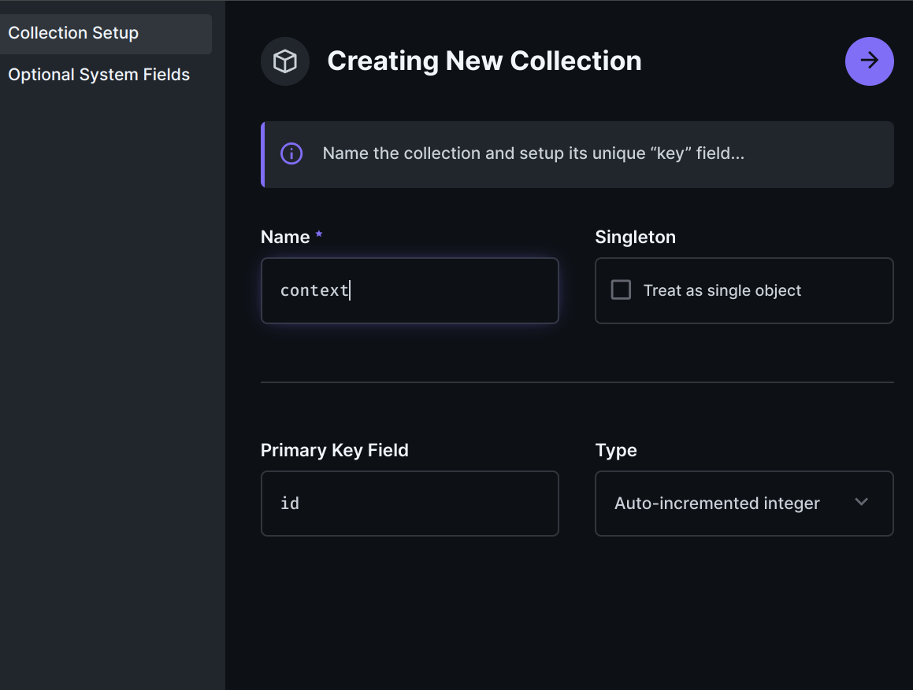

# Directus Extension Context Interface

This extension provides a custom interface for managing many-to-many relationships within Directus. It simplifies the process of linking items across collections, making it easier to establish and manage complex relational data structures.

## Features

- **Custom Interface**: A dedicated interface component for handling many-to-many relationships.
- **Relational Support**: Designed specifically for relational data, enhancing the Directus relational capabilities.
- **Ease of Use**: Simplifies the management of many-to-many relationships, making it more intuitive and user-friendly.

## Getting Started

To use this extension, follow the steps below to install and configure it in your Directus project.

### Prerequisites

Ensure you have Directus installed and running on your system. This extension requires Directus 9.26 or newer.

### Installation

1. Clone or download this extension into your Directus project's extensions directory.

```bash
cd path/to/your/directus/extensions/
```

```bash
git clone https://tfs.globex.local/GlobalExchange/ContentManagement/_git/Contexts_Interface_Directus_Extension.git
```

2. Restart your Directus server to load the new extension.

```bash
npx directus start
```

### Configuration

No additional configuration is needed. Once installed, the M2M Context interface will be available in the Directus App when creating or editing fields in your collections.

## Usage

### Creating a Context Filtered by Types

This document describes how to create a hierarchical context system with type filtering using collections in a database.

#### 1. Defining the Context Type Collection

Suggested name for the collection: `context_type`

##### Field Configuration


1. **Key:**
   - Change from `id` to `key` (to later assign key values)
   - Type: Manually entered string


1. **Parent:**
   - Field name: `parent`
   - Type: Relational (M2O)
   - Relation: Recursive with `context_type`
   - Description: Allows creating a hierarchy of context types

#### 2. Defining the Context Collection

Suggested name for the collection: `context`

##### Field Configuration



1. **Primary Key:**
   - Keep `id` as autoincremental


2. **Type:**
   - Field name: `type` (important to maintain this name)
   - Type: Relational (M2O)
   - Relation: With the `context_type` collection
   - Description: Allows filtering by context type


3. **Value:**
   - Field name: `value`
   - Type: String
   - Description: Stores the context value


4. **Parent:**
   - Field name: `parent`
   - Type: Relational (M2O)
   - Relation: Recursive with `context`
   - Description: Allows creating a hierarchical structure of contexts

#### 3. Creating a Specific Context (example: Web Page)

For this example you need create context types and contexts into the collections `context_type` and `context`.

Suggested name for the collection: `context_web`

##### Field Configuration


1. **Primary Key:**
   - Keep `id` as autoincremental


2. **Context:**
   - Field name: `context`
   - Type: Context Tree Selector
   - Relation: With the `context` collection
   - Additional configuration:
     - Enable "Select Types" to filter context nodes
     - Filtering is done by the `type` field defined in the `context` collection

#### Result

The following images show the result of the context tree selector with the defined context types and contexts.


> First one shows the full context tree, 


> the second one shows how to change the context tree filtered by types,


> and the last one shows the context tree filtered by types and with the selected context nodes.

#### Important Notes

- The Context Tree Selector allows linking relationships with the previously formed context tree.
- The "Select Types" option narrows down the tree to show only relevant nodes based on the selected context type.
- By default if you not select types, all types are shown.

This structure allows creating a flexible and hierarchical context system, with the ability to filter by specific types, which is useful for organizing contextual information in complex applications such as websites or content management systems.

## Contributing

Contributions are welcome! Please read our [Contributing Guide](CONTRIBUTING.md) for details on how to submit pull requests and suggestions.
